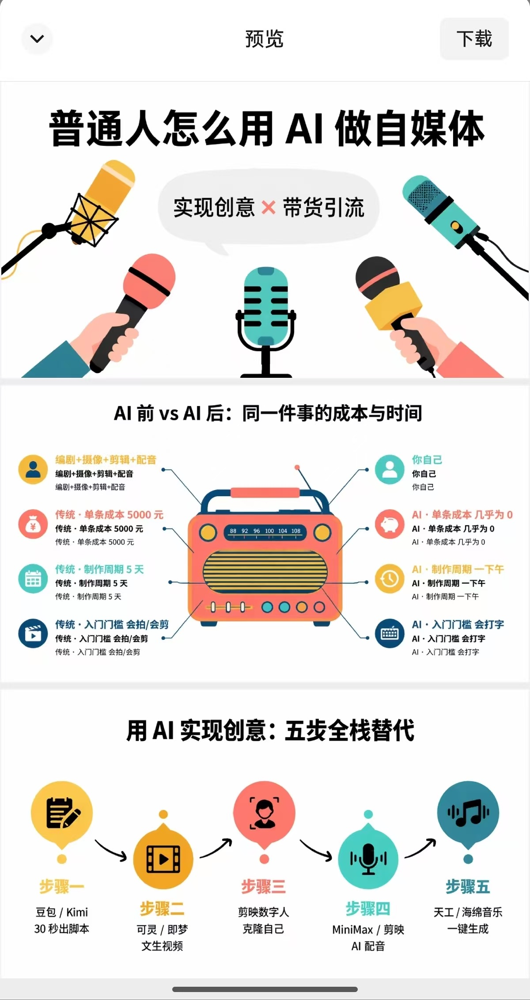
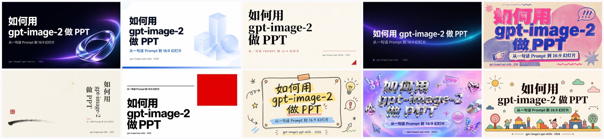

<div align="center">

# gpt-image2-ppt-skills

**Generate design-forward, highly polished PPT decks with OpenAI `gpt-image-2` in one shot.**

Works natively in Claude Code, Codex, OpenClaw, Hermes, and any other Skill-compatible agent. Once installed in your agent, a single natural-language prompt yields 16:9 high-res images + a ready-to-send `.pptx` — or clones any reference `.pptx` template and reskins it with new content.

Instead of filling text into traditional templates, it uses the visual taste, composition, and layout strengths of `gpt-image-2` to generate each slide as a complete visual composition, aiming for decks that look polished, consistent, and presentation-ready from cover to inner pages.

The project also includes dedicated optimization for editing image-based PPTs. The normal workflow keeps each complete visual composition as a full-slide image. When native PowerPoint objects are explicitly required, an **opt-in editable mode** can reconstruct known text, basic shapes, connectors, and complex visuals as separate objects. This mode is off by default.

[](../LICENSE)
[](https://www.python.org/)
[](https://www.anthropic.com/claude-code)
[](https://platform.openai.com/docs/guides/images)
[](https://github.com/JuneYaooo/gpt-image2-ppt-skills/stargazers)

🌐 **中文** → [../README.md](../README.md)

</div>

---

## 🎬 Demo: feed one template, get a fresh deck in that style

<table>
<tr>
<th width="50%">Input: any reference template (.pptx / image)</th>
<th width="50%">Output: cloned layout + new content</th>
</tr>
<tr>
<td></td>
<td></td>
</tr>
<tr>
<td align="center"><sub>English infographic template (Mass Media Infographics)</sub></td>
<td align="center"><sub>Same layout / palette / illustration vocabulary, content swapped to "how normal people make AI-powered social content"</sub></td>
</tr>
</table>

---

## 🧩 Opt-in editable mode example

Editable mode still lets `gpt-image-2` create the complete art-directed slide first. A post-generation scene then reconstructs text and basic graphics as native PowerPoint objects while keeping complex artwork as independent image layers.

<table>
<tr><th width="50%">Original complete visual</th><th width="50%">Office render of editable PPTX</th></tr>
<tr>
<td></td>
<td></td>
</tr>
</table>

The PPTX contains **13 selectable objects**: 5 native text boxes, 6 native shapes, 1 clean plate, and 1 movable and resizable mascot-and-ice-cream image layer. Text and basic graphics remain directly editable in PowerPoint, while the complex hero artwork preserves the full `gpt-image-2` visual quality.

- [Download the editable Case 05 PPTX](../examples/editable-pptx/case05-summer-poster/editable.pptx)
- [View the complete Case 05 study: source visual, separated layer, edge checks, and quality report](../examples/editable-pptx/case05-summer-poster/)

When you need an editable deliverable, you can ask:

> Create this deck in editable mode. Keep text and basic graphics directly editable in PowerPoint, make the complex hero visual independently movable, and preserve as much of the complete `gpt-image-2` art direction as possible.

Object-level reconstruction is used only when the user explicitly asks for editable text, separable elements, movable artwork, or similar requirements. Otherwise, the default image-first workflow continues to prioritize the strongest visual result.

> ⚠️ **Editable mode requires a working local PPTX renderer.** Just like template-clone mode, it needs executable Windows PowerPoint, macOS Keynote, or LibreOffice. Users do not need to run a check command; they only need to describe the editable deliverable in natural language as shown above. The Skill checks the environment automatically, then renders the finished `-editable.pptx` to `editable_renders/page-XX.png` for page-by-page visual review by a multimodal agent. Without a usable renderer, an unreviewed editable file is not reported as a successful deliverable.

Editable reconstruction is **quality-first with controlled generation rounds**. Low-cost preflight checks and render reviews may run repeatedly. The workflow first uses deterministic fixes such as font, coordinate, crop, and layering changes; then original-pixel extraction and occlusion completion; then AI regeneration only for failed complex layers. A full-slide regeneration is reserved for structural composition failures.

---

## 🚀 Quick start

### 1. Ask your AI assistant to install the Skill

Send this to Claude Code, Codex, OpenClaw, Cursor, Trae, Hermes Agent, or another Skill-compatible assistant:

> Please install gpt-image2-ppt-skills:<br>
> https://raw.githubusercontent.com/JuneYaooo/gpt-image2-ppt-skills/main/docs/install.md

The assistant installs it for the current environment and tells you when to restart.

### 2. Describe the deck you want

**Generate a new deck**

> Make a 6-slide deck about “How AI changes content creation.” Show me one cover first, and use a refined high-tech visual direction.

**Follow a template**

> I uploaded `company-template.pptx`. Follow its layout, palette, and visual language to make an 8-slide deck about our annual product strategy.

**Request an editable deliverable**

> Create this deck in editable mode. Keep text and basic graphics directly editable, make the complex hero visual independently movable, and preserve the complete `gpt-image-2` art direction.

The assistant organizes the content, confirms one visual sample, generates the full deck, and returns the images, PPTX, and output location.

---

## ✨ What it does

- 🎨 **10 curated styles + an expanded style library** — built-ins include Spatial Glass / Tech Blue / Editorial Mono / Dark Aurora / Risograph / Wabi / Swiss Grid / Hand Sketch / Y2K Chrome / Vector Illustration; on 2026-05-26, 22 additional high-quality styles were selected from 500+ publicly available PPT templates
- 🧭 **Prompt Recipes** — `examples/` provides starter `slides_plan.md` templates for common scenarios such as product launches, investor pitches, weekly reports, courseware, thesis defenses, and book talks
- 🪄 **Template-clone mode** — drop in any `.pptx`; the agent follows its layout, palette, and illustration language, then swaps in your new content
- 🎯 **Precise natural-language edits** — say "change slide 3's subtitle", "remove the footer", or "replace these three metrics"; the agent regenerates only the target slide through image-to-image editing while trying to preserve the original style and layout
- 🎮 **Dual output** — high-res PNG per slide + 16:9 `.pptx` ready to use
- ⚡ **10-way concurrency by default** — a 10-page deck finishes in ~30s
- 🧪 **Preview one slide first** — approve the cover before generating the full deck
- 🧾 **Trackable edits** — changed slides and generated versions can be traced and rolled back
- 🧩 **Opt-in editable output** — explicitly requested decks can use native text, shapes, connectors, and independent picture layers

## ✅ Best-fit use cases

| Use case | Fit | Notes |
| --- | --- | --- |
| Generate a new deck from a topic | Strong | Good for reports, pitches, training, courses, product intros. |
| Create a new deck from a company template | Strong | Provide a `.pptx`, approve one cover first, then run the full deck. |
| Edit titles, subtitles, dates, footers | Strong | The most stable editing scenario. |
| Update metric cards and key numbers | Good | Works, but every number must be checked before delivery. |
| Modify only one slide in a multi-slide deck | Good | The target slide is regenerated; other slides are left alone. |
| Dense tables, financial reports, legal long copy | Weak | Small text and numbers need strict human review. |

If the user only has a rough topic and no complete outline yet, the agent can first consult [`examples/`](../examples/) to draft a scenario-appropriate `slides_plan.md`, ask for confirmation, then convert it to `slides_plan.json` and continue with generation.

## 🎨 The 10 built-in styles

> Below: the 10 styles each generating one cover under the same topic — "**How to make a PPT with gpt-image-2**". All covers are raw `gpt-image-2` output, no PS.



| Style ID | One-liner | Use cases |
| --- | --- | --- |
| `gradient-glass` | Apple Vision OS / Spatial Glass | AI product launches, technical talks, creative pitches |
| `clean-tech-blue` | Stripe / Linear-grade blue & white | Investor decks, business plans, corporate strategy |
| `vector-illustration` | Retro vector + black outlines | Education, brand storytelling, community sharing |
| `editorial-mono` | Kinfolk / Monocle editorial | Brand reveals, cultural interviews, book talks |
| `dark-aurora` | Linear / Vercel dark neon | AI products, dev tools, technical talks |
| `risograph` | Riso 2-spot-color print + halftone | Creative studios, indie zines, design agencies |
| `japanese-wabi` | Muji / Hara Kenya wabi-sabi | Tea ceremony, lifestyle, luxury, cultural lectures |
| `swiss-grid` | Bauhaus / Vignelli international grid | Academic reports, museum exhibits, serious dashboards |
| `hand-sketch` | Sketchnote / whiteboard | Workshops, product brainstorming, training |
| `y2k-chrome` | Y2K liquid chrome + butterfly stickers | Streetwear, entertainment, brand collabs, Gen-Z marketing |

## 🧬 Expanded style library: 22 new styles added on 2026-05-26

On 2026-05-26, we added 22 high-quality styles selected from 500+ publicly available PPT templates. More styles will continue to be added, and good PPT template or style references are welcome.

See the full style table, thumbnails, style IDs, visual traits, and use cases in [`distilled-styles.md`](./distilled-styles.md).

---

## 🧪 Editing Capability Report

If you care about "how reliable are edits in real scenes", see the user-facing case report:

- **[`docs/edit_guide.md`](./edit_guide.md)** — title replacement, date edits, footer removal, metric updates, logo insertion, single-slide edits in a multi-slide deck, current limitations, and a delivery checklist

Summary:

| Capability | Current behavior |
| --- | --- |
| Short text edits | Stable for everyday delivery. |
| Multiple explicit edits | Works best when the user clearly says what should stay unchanged. |
| Metric slides | Works, but numbers must be checked. |
| Small icon / logo insertion | Works for style-matched icons; real brand logos need source assets. |
| Native PowerPoint object editing | Default output uses full-slide images; opt-in editable mode emits native text, shapes, connectors, and independent picture layers. |

<details>
<summary>Developer note: internal editing mechanism diagram</summary>


</details>

---

## 🛠 Manual install and advanced configuration

Most users should use the natural-language installation shown above. Use manual installation when you need to manage the repository and environment yourself:

```bash
git clone git@github.com:JuneYaooo/gpt-image2-ppt-skills.git
cd gpt-image2-ppt-skills
bash install_as_skill.sh --target claude   # Claude Code
# or
bash install_as_skill.sh --target codex    # Codex
```

The script installs the skill into the selected agent directory:

- Claude Code: `~/.claude/skills/gpt-image2-ppt-skills/`
- Codex: `~/.codex/skills/gpt-image2-ppt-skills/`

<details>
<summary><strong>Direct API and secret configuration</strong></summary>

If you use direct API mode, inject environment variables through your agent
framework instead of writing secrets into the caller project's root `.env`:

- Claude Code: user-level `~/.claude/settings.json`, or project-level `.claude/settings.local.json`
- OpenClaw / custom agents: reference system env vars from `apiKey` / env config
- CI / servers: system env vars, Docker Compose, Kubernetes Secrets, or CI Secrets
- Standalone CLI: set `GPT_IMAGE2_PPT_ENV=/path/to/private.env`, or use the skill install directory `.env` as a fallback

```bash
# Variable names:
OPENAI_BASE_URL=https://api.openai.com    # or any OpenAI-compatible relay
OPENAI_API_KEY=sk-...                     # required
GPT_IMAGE_MODEL_NAME=gpt-image-2
GPT_IMAGE_QUALITY=high                    # low / medium / high / auto
```

> In **Codex**, if the current agent has native image generation, use the native path in `SKILL.md` and skip `OPENAI_API_KEY`.
>
> 🔒 **Won't accidentally eat your secrets**: the script only reads the current process env, platform-injected variables, an explicit `GPT_IMAGE2_PPT_ENV`, and the skill install directory `.env` fallback. It does **not** walk up into caller project directories.
>
> 🪄 Template-clone mode and editable mode both require an executable PPTX renderer such as Windows PowerPoint, macOS Keynote, or LibreOffice. Template cloning renders the source deck so the AI can inspect its layouts; editable mode renders the deliverable so the AI can visually review it. The Skill checks local support first and explains how to install a compatible renderer when unavailable. Template cloning may also use manually exported template-page images.

</details>

<details>
<summary><strong>Vision analysis for template clone</strong></summary>

In template-clone mode, the skill needs to "see" your `.pptx` template's visual style first. **If your AI assistant is already multimodal** (Claude Code with Claude Opus/Sonnet, Codex with GPT multimodal, etc.), the agent will analyze the visual style directly and generate a `template_profile.json` with `reference_image` to pass to the CLI with `--template-profile`. **No extra configuration needed.**

Only when your agent uses a text-only model (e.g., DeepSeek text model), you'll need the following env vars to use a separate multimodal model for template analysis:

```bash
# Optional: vision analysis for template clone (only needed by text-only agents; skip for multimodal agents)
VISION_BASE_URL=https://your-openai-compatible-relay.example.com/v1
VISION_API_KEY=sk-...
VISION_MODEL_NAME=gemini-3.1-pro-preview   # or gpt-4o / claude-3.5-sonnet, any multimodal SKU
```

> Supports any multimodal model compatible with the OpenAI `/v1/chat/completions` format (Gemini / GPT-4o / Claude, etc.). Fully decoupled from `gpt-image-2` — switching the vision provider won't affect image generation.

</details>

---

## 📚 Technical documentation

- [SKILL.md](../SKILL.md) — authoritative workflow, behavior rules, and advanced usage
- [Installation guide](./install.md) — installation across supported agents
- [PPT implementation logic](./ppt-implementation-logic.md) — image generation, real assets, and PPTX packaging
- [External-image overlay logic](./external_image_overlay_logic.txt) — slot planning and source-image overlay flow
- [Editing capability report](./edit_guide.md) — reliable edit cases, limitations, and review guidance
- [Style library](./distilled-styles.md) — built-in and expanded style previews

## 🆕 Changelog

- **2026-07-13 · Editable render-back and iteration policy** — `--editable` now requires a working PowerPoint, Keynote, or LibreOffice renderer, automatically emits `editable_renders/page-XX.png` for multimodal review, and uses a quality-first escalation policy with repeated low-cost checks and targeted repairs before any full-slide regeneration.
- **2026-07-11 · Editable mode** — Explicit editable-delivery requests can reconstruct complete visual masters as native text, shapes, connectors, and independent image layers. Overlapping assets follow the A1 original-pixel extraction → A2 occlusion completion → B AI separation/regeneration route. Default behavior is unchanged.
- **2026-05-31 · Two modes for real assets** — Product screenshots, logos, charts, tables, medical images, and evidence screenshots are preserved as independent source-image objects by default; users can explicitly allow reference-based redraws.
- **2026-05-26 · Expanded style library** — Added 22 selected styles covering business, academic, education, food, fashion, healthcare, and sustainability presentations.

---

## 🙏 Acknowledgements

- [op7418/NanoBanana-PPT-Skills](https://github.com/op7418/NanoBanana-PPT-Skills) — reference for the original style prompts and early skill structure. This project swaps the image backend from Nano Banana Pro to OpenAI gpt-image-2, rewrites the 3 inherited styles and adds 7 new ones (10 total), and layers on template-clone mode (vision-based style extraction from any user `.pptx`), an md-first authoring flow, automatic `.pptx` packaging, and a codex CLI fallback backend.
- [lewislulu/html-ppt-skill](https://github.com/lewislulu/html-ppt-skill) — reference for the Claude Code skill `SKILL.md` frontmatter.

## 💬 Community

[**LINUX DO — Chinese Developer Community**](https://linux.do/)

## ⭐ Star History

[](https://star-history.com/#JuneYaooo/gpt-image2-ppt-skills&Date)

---

## License

Apache License 2.0 — see [LICENSE](../LICENSE).
