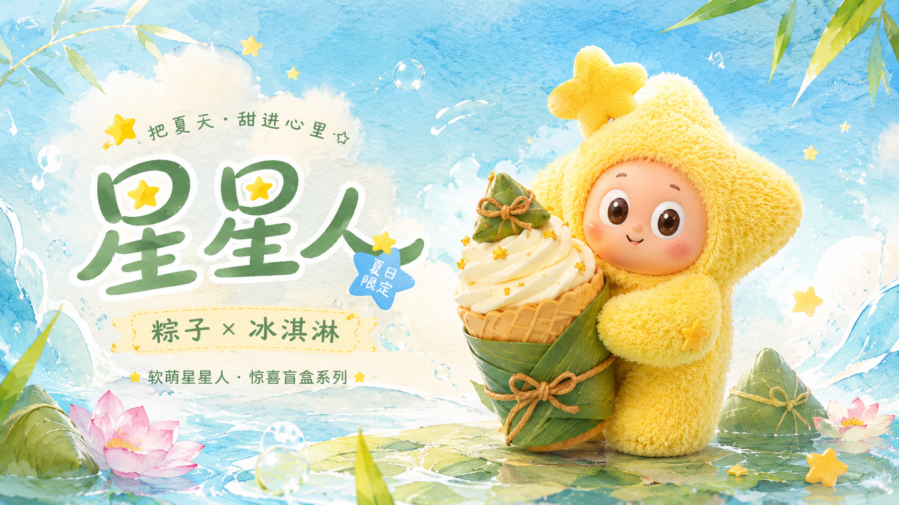
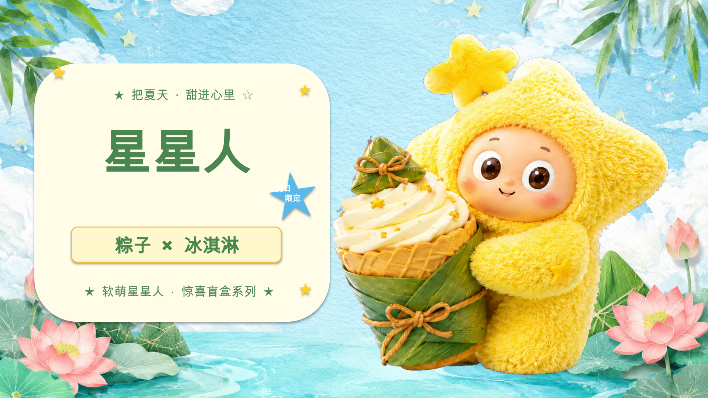
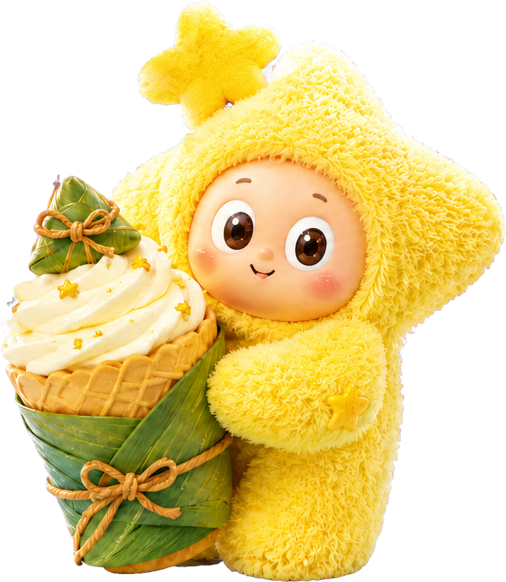
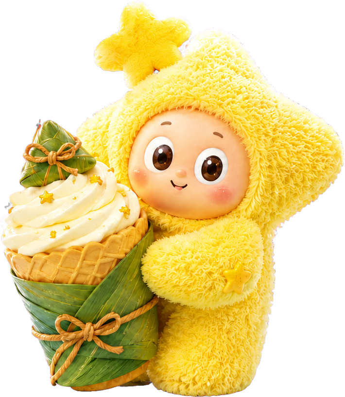
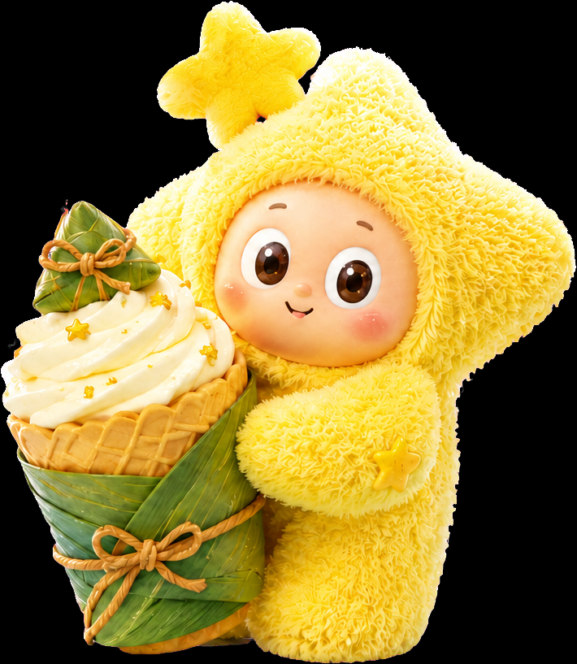

# Case 05：夏日星星人可编辑海报

这个案例展示如何保留 `gpt-image-2` 完整视觉稿的美感，同时把文字、基础图形和复杂主视觉重建为可分别操作的 PowerPoint 对象。

**[下载可编辑 PPTX](./editable.pptx)**

## 原始视觉与可编辑结果

<table>
<tr>
<th width="50%">原始完整视觉稿</th>
<th width="50%">可编辑 PPTX 的 Office 回渲染</th>
</tr>
<tr>
<td></td>
<td></td>
</tr>
</table>

重建后的版式、色彩、材质和主视觉关系与原稿保持一致，但 PPTX 中实际包含 **13 个可选对象**。

## 拆成了哪些对象

| 对象类型 | 数量 | 内容 | 在 PowerPoint 中可以做什么 |
| --- | ---: | --- | --- |
| 原生文本 | 5 | 顶部标语、主标题、限定徽章文字、产品名、底部说明 | 修改文字、字体、字号、颜色和位置 |
| 原生 shape | 6 | 水彩文字面板、夏日徽章、产品横幅、3 颗装饰星 | 修改填充、描边、大小和位置 |
| Clean plate | 1 | 水彩天空、云朵、荷叶、荷花和整体光感 | 作为完整背景保持画面质感 |
| 独立图片层 | 1 | 星星人、粽子冰淇淋及其重叠关系 | 整组移动、缩放、旋转或替换 |

## Clean plate：移走对象后不会露出重影

文字面板、文案和右侧主视觉已经从背景中移除。用户移动文字或主视觉时，底下不会再出现一份模型原先画出的重复对象。

## 独立主视觉素材

星星人、粽子冰淇淋与顶部星星存在明显遮挡关系。默认策略不是把每个被遮挡对象强行拆成残缺碎片，而是把它们作为一个完整组合层提取，保留原来的构图和叙事关系。

  

## 透明边缘检查

毛绒、白色冰淇淋、半透明高光和水彩边缘很容易出现白边、黑边或残留底色，因此透明素材同时放到白底和黑底上检查。

<table>
<tr>
<th width="50%">白底检查</th>
<th width="50%">黑底检查</th>
</tr>
<tr>
<td></td>
<td></td>
</tr>
</table>

## 为什么这个案例使用 B 路线

可编辑模式对重叠素材采用 A1 → A2 → B 路由：

1. **A1 原像素直接提取（默认）**：原素材轮廓完整、边缘干净时，直接从完整视觉稿中提取；互相重叠的素材默认保留为一个组合层。
2. **A2 原像素 + 遮挡补全**：保留能看到的原像素，只补全被遮挡区域以及对象移走后暴露的背景。
3. **B AI 分离或重生成**：只有 A1/A2 的边缘或补全效果不合格，或者用户明确要求设计模式时才升级。

本页同时包含黄色毛绒、白色冰淇淋、水彩云、细小高光和多层遮挡。A1/A2 的直接抠图测试在毛发与浅色边缘处不稳定，因此升级到 B：参考原图生成单色键背景的完整组合素材，再进行本地去背景和黑白底复核。

## 哪些内容仍然保留为图片

可编辑不等于把每个像素都转成 PowerPoint 矢量图形。水彩背景继续作为 clean plate，毛绒角色和食物摄影质感继续作为透明图片层；这些内容如果硬转成 shape，反而会明显损失 `gpt-image-2` 的美感。

文字、规则面板、徽章、横幅和装饰星则适合用 PowerPoint 原生对象重建，因此可以直接编辑。这种混合方式兼顾视觉质量和实际修改能力。

## 验证材料

- [下载可编辑 PPTX](./editable.pptx)
- [查看页面对象清单（scene）](./slide-01.scene.json)
- [查看质量报告](./quality-report.json)

质量报告记录了 1 页、5 个原生文本、6 个原生 shape、1 个独立图片层和 2 个图片对象（clean plate + 独立主视觉）。最终 PPTX 已通过真实 Office 渲染和人工视觉检查。
